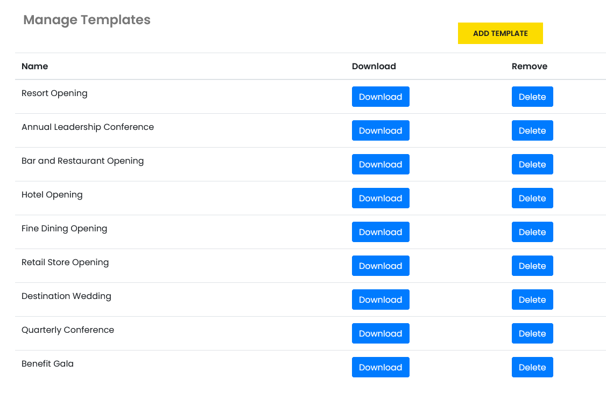

# Welcome to Usher Openings and Events

Created in partnership with Marriott International, Usher is designed to manage Openings which can span years and often have many changes to the schedule.

Built as a SaaS \(**S**oftware **a**s **a** **S**ervice\) application, Usher makes schedule management for opening a new restaurant, hotel, store, or business simple and efficient.

New hires, trainers, vendors, and management simply go online via any web browser to find their onboarding schedules, information, and locations to meet.

Management can change information and schedules anytime and updates are **immediately available** online.

[Templates](manage-opening.md#create-templates) are just one key feature in Usher that will save you tons of time.

Every opening requires sets of sessions that are the same or very similar each time. In Usher, you can create templates to kick start your next opening by loading those sessions up front. There is no limit to how many templates you can store in Usher.

If you manage multiple brands or have openings that require different sets of sessions based on the size of the location, no problem. Create a template for each option.

## Openings _and_ Events 

The other half of Usher handles scheduling for Events: Multi-Day Events and Single-Day Events

**Multi-Day Events**

Multi-Day Events feature unlimited numbers of sessions over unlimited days/weeks/months - even years. Events are not for new hires and training and thus this is tailored to a more general event audience.

Conferences, Festivals, and Destination Weddings are examples of Multi-Day Events

The general structure of an Event in Usher is the same as an Opening but with some small adjustments. Tracks replaces Positions as the main required field for all sessions in Events.

**Multiple Session Events - Single Day**

For Events that will be scheduled for just one jam-packed day of sessions, Usher offers Multiple Session Events on a Single Day.

_Multi-Day and Single-Day Events are differentiated only due to the Shift Dates feature in Usher which allows you to change the dates of all of the sessions for your Opening or Event within seconds._

[Create an account today](create-account.md#creating-an-account-on-usher-is-simple-and-free) and try it yourself!

If you get stuck, check the documentation here or [send us a message](https://usher.events/contact) and we will be happy to help.

