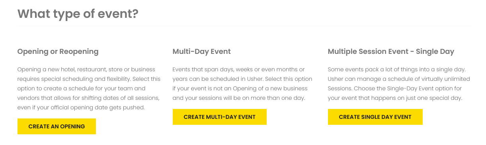

# Create Event

## Overview 

Events in Usher can be Multiple-day or Single-day, both comprised of sessions - classes, meetings or any other activities that people need to attend. Sessions on the schedule are filterable by Track and Category.

Choosing a **primary track is required** for each session and is what determines the color coding you see on the public schedule.

Tracks are commonly used for Conferences but also applicable to most types of events.


For example at a Photography Conference you may have these tracks: 

* Photo Editing and Post-Production, 
* Lighting and Using Off-Camera Flash
* Posing Models and Portraiture
* Nature and Landscape Photography


Usher allows you to select any additional tracks that also require that session so people in those tracks will see the session on their schedules when filtered.

**Events require an Opening and Closing date** **for multi-day events or a single date for the one day events.**

Dates can change many times in the planning process.


Usher has a powerful feature which allows you to reschedule your entire Event called  
[Shift Dates](manage-event.md#shift-dates).


The SHIFT DATES feature allows you to shift the dates of all of the sessions in your event based on the Opening Date of the event.

Here is how the T+/- works:

You set your opening date. Then each session is set at a T- \(or +\) number.

* 0 = Opening day
* -1 = One day before opening
* -3 = Three days before opening
* +1 = Day two of your event
* +4 = Day five of your event

Note: You can also enter dates the standard way without using the T+/- and it will automatically set your T numbers.

When your event date gets pushed back, you simply select your new Opening Date and all sessions will shift to the new schedule.

Let's walk through how to create a complete event.

## Create an Event 

From the main menu, select CREATE

You will see three options for types of events. Choose either Multiple-Day or Single-Day.

## Custom URL 

The first step is to select your custom URL.


_Example_: photographyconference.usher.events


Your event schedule and details at your custom URL will be available when you [GO LIVE](create-event.md#go-live) with your event.

Anyone with the URL will be able to visit your customizable site for your event.

You can choose any combination of letters and numbers for your custom URL.


Usher will not let you choose any URL that has already been used.


**Choose your URL carefully.** Your custom URL is not editable after you have created your opening or event. Almost everything else can be changed later except the URL.

## Event Dates 

Select your Event Date\(s\)

_What if I don’t know what the date\(s\) will be yet?_

The dates are required but can be changed as many times as you want. Choose a date or dates anytime in the future.

All Events and Openings are held in [DRAFT status](../getting-started/create-account.md#draft-status) until you choose to [GO LIVE](create-event.md#go-live). This means that your schedule and information about your event are not yet shown online at your chosen URL.

**You can change your event date\(s\) as many times as you need both before and after you** [**GO LIVE**](create-event.md#go-live)**.**

## Adding Sessions 

There are three ways to add Sessions to your Opening or Event:

1. From a CSV file
2. From a Template
3. Individually

After selecting your Event Dates, you have the option to add sessions from a template or from a file upload or individually in form view.

### From CSV File 

To upload from a file, select Browse to find the .csv file that you want to use.

Below is a link for an example file showing the fields and formatting for your file upload to work properly.



1. Select Open to choose the file
2. Back on the Usher screen select the yellow SAVE button
3. Be patient as the sessions load into your event
4. Once complete you will see a count of how many sessions were added and you can go on to the next step

### From Template 

Any templates saved in your account will show in the drop-down list for you to choose.

Select the one you want then click SAVE.


If you choose the wrong file, you can click the Discard File button and choose another file.


**Be patient as the sessions load.**

When finished Usher will show a notification that the upload was successful and automatically take you to the next step.


If your file upload fails, you can discard the file and try again with another file.


### Individually 

Neither a Template or File upload is required. You can add each session individually by skipping those options. 

[Individual Sessions can be added](create-event.md#add-individual-session) in form view once you have completed the initial create process.

## Event Details 

For your opening or event personalized site, you can add your own image, contact information and messaging.


All details are optional. You can choose to scroll to the bottom of the page and select SAVE to skip adding details.


Usher features an in-screen text editor which provides editing options such as bold, italic, lists, links and images.


Using the text editor, you can add as much detail as you would like about your event or opening and you can update it anytime. Changes will be updated in real time on your event site.


To preview how the information will look on your custom home page, select the eye symbol.

Additional information with examples for using the text editor can be found in Advanced Options - [Syntax for Text Editor](syntax-for-text-editor.md)

### Upload an Image 

To upload your own image for your customized home page, select Browse for Image and choose the file from your computer.


The best size for your image is 900px by 1000px. 


Usher will work to resize large images immediately after they are uploaded. Wait until the thumbnail view shows to see that your image has been uploaded properly.

**If you choose not to upload your own image, a default image will be used.**


When the thumbnail appears and it shows the default image instead of the image you attempted to upload, you need to resize your image to a smaller file size. 

Once you have reduced the size of your image, try browsing to it and uploading again.


### Contact Information 

You may provide a name, phone number, email address or any combination of those on your home page for a quick way to get help if needed.

None are required.

### Location for the Event 

Usher allows you to select a Location for your entire Event, which is shown on the Location tab on your personalized site.

1. In the Google map search bar, enter the address of your event.
2. A list of addresses will show that Google thinks match what you want.
3. Select the correct address and the map will adjust to that location.
4. Scroll to the bottom of the screen and select CONTINUE TO SESSION REVIEW/EDIT.

_Specific locations for each session are also available in the Add/Edit Sessions views._

## Add Individual Session 

Once you SAVE the details for your Event, you will land on the [Manage Sessions](manage-event.md#manage-sessions) screen.

From here you can add individual sessions by clicking the + button.

In the Session form view you will see all of the fields that are included in a single session.

These fields are REQUIRED:

* ID \(this is required but will be filled automatically if not specified\)
* Session Title
* Date or T +/-
* Start Time
* End Time
* Track
* Published \(defaults to Yes which means it will show on the Schedule\)

Optional Fields:

* Description
* Additional Position\(s\)
* Categories
* Locations
* Presenters

### Session Title

Each session requires a title. The title can use any combination of letters and numbers. It does not have to be unique. If you have a _Stand-Up Meeting_ daily, that can be the title of each daily session. 

### Session ID 

The session ID must be unique. 

If you do not enter an ID \(numeric only\) one will be assigned.

### Session Date and T+/- 

The Date and T+/- are linked. Changing one will change the other so you do not have to worry about syncing those.

Each session is set at a T- \(or +\) number.

* 0 = Opening date
* -1 = the day before opening
* -9 = nine days before opening
* +1 = the day AFTER opening

Note: You can also enter dates the standard way without using the T+/- and Usher will automatically set your T numbers.

### Start Time and End Time

Select the Start Time and End Time for each session using the arrows or by selecting the number and typing in the exact time.

### Primary Track 

The Primary Track is required and **determines the color coding** that you see on the live schedule.

All tracks that have been added to this Event will be available in the drop-down menu to select.

You can add a new track to the list by clicking Add New Position.

A pop up box will show and you must enter the name of the track and choose a color for that new position.


Everything is easily editable later.


_If you do not care about dividing your event by tracks or the color coding used on the schedule, simply create one track type and use that as the primary track for every session._

### Additional Tracks 


Selecting the Track and Additional Tracks determines which people will see this session on their schedule when they use the schedule filters.


Choose all tracks for people who should be attending the session.

_You do not need to select the Primary Track in Additional Tracks._

### Categories 

Categories provide an optional additional way to filter your schedule.

To add a new category select the Add New Category button and enter the name in the pop up box.

Each session can have multiple categories.

### Session Location 

Usher provides an option to add a specific location for each individual session.


_Examples_: Conference Room B, Front Desk, Antonio's Restaurant, Main Stage


To add a new location to the list, select Add New Location. A pop up box will appear.

**The only required field is the Location Name.**

Optionally, you may add full address details.

### Presenters 

Presenters are optional.

These may include trainers or speakers or anyone presenting information for this session.

To add a new Presenter select the Add New Presenter button. A pop up box will appear.

**First Name, Last Name and Type are REQUIRED**. Email is optional.

Each session may have multiple presenters.

Note: [Presenters can be added later](manage-event.md#presenters) from a file and mapped to each session.

## Edit Individual Session 

Go to My Events

1. Under the heading for Sessions \(Sess\) in the row of the Opening you want to Edit.
2. Select the number \(indicates the number of total sessions in your Opening\) which will take you to the next screen.
3. Select the Session Name \(link shows in blue\).
4. This will take you to the Edit Session View.
5. Make any changes to your session details.
6. Be sure to click SAVE CHANGES when done.

## My Events 

Once you have created your Opening or Event, as an administrator, **this is your home base**.

Every current and future opening and event will show in the list by default, divided by Opening and Event tabs.

Select the Event tab to see your Events.

You can choose to Show Past Events by selecting the slider button.

**The numbers under each item indicate the count for that item in your Event.**

For example, under Track the number shows 14.  That is the number of different Tracks currently in your Event.

Selecting any number or Edit link will open the details for that item.

Details on each item in this list are outlined in the Manage Event Section and they are linked here for your reference:

* [Name](create-event.md#view-my-event-online)
* [URL](manage-event.md#view-url)
* [Sess \(Sessions\)](manage-event.md#manage-sessions)
* [Adm \(Event Admins\)](manage-event.md#event-admins)
* [Pres \(Presenters\)](manage-event.md#presenters)
* [Tracks](manage-event.md#tracks)
* [Loc \(Locations\)](manage-event.md#locations)
* [Att \(Attendees\)](manage-event.md#attendees)
* [Options](manage-event.md#options)
* [Details](manage-event.md#details)
* [Shift Dates](manage-event.md#shift-dates)
* [Status](manage-event.md#status)
* [Cancel](manage-event.md#cancel)

## GO LIVE 

Events stay in DRAFT status by default until you choose to GO LIVE.

When you are ready to make your unique URL live with your personalized home page and event details, go to My Events, select the number under Sess on the Event you are ready to make live.

Select the GO LIVE yellow button

You will be prompted to enter your Corporate code first.

If you do not have a code, select the button **I don’t have code** to continue.

This begins the checkout process.


For Corporate accounts and subscription accounts, your DRAFT openings and events will never expire.

For all others your DRAFT opening or event will expire, which means it will be archived and no longer editable, 6 months after your Opening Date.


## View my Event Online 

Once you have made your opening or event live, you can see your personalized home page at the URL you selected when you created your opening or event.

Go to My Events, select the URL button on the row of the opening or event you want to view and click that to see the full URL.

Also from My Events, you can click on the Name of your opening or event and it will open your personalized site in a new tab.

## Filter the Online Schedule 

Filters are available for Positions, Categories and a date range.

You can select more than one of each to view.

To deselect any item, click the X next to that item.

To deselect all items in one group, click the X at the far right side of the selection box.

For a date range, click inside the start box and choose a date from the calendar. Then do the same for the end date.

