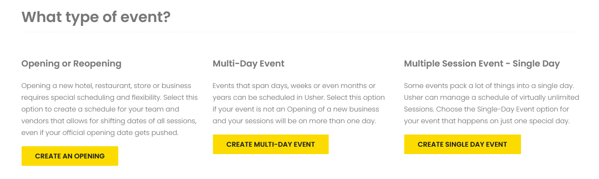
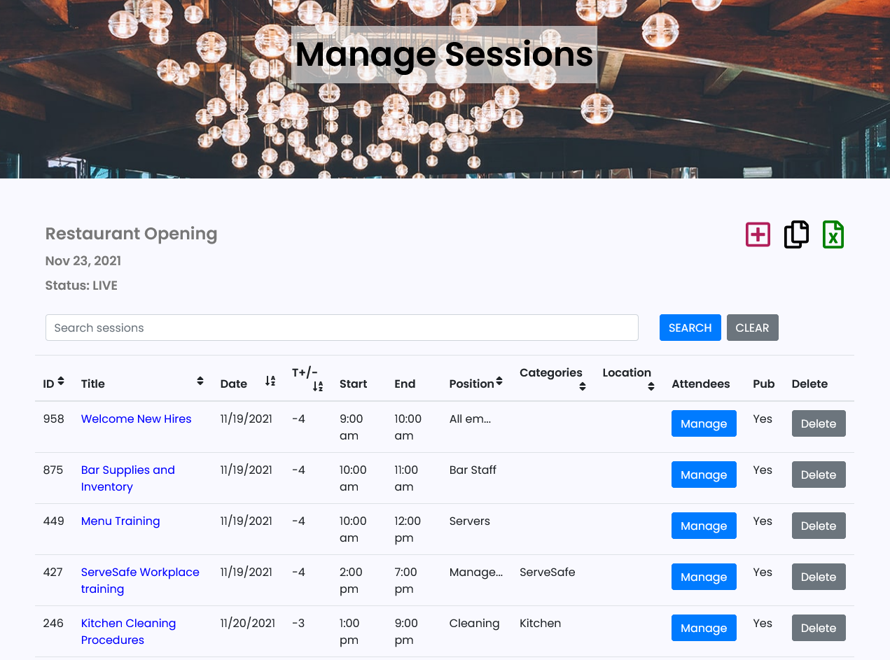
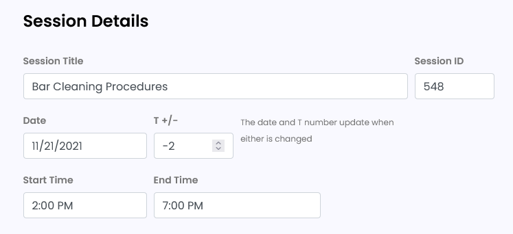
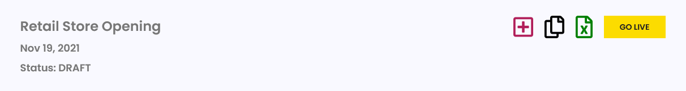

# Create Opening

## Overview 

Openings in Usher are tailored specifically to hotels, restaurants, stores and other businesses getting ready or planning to open a new location. Openings are comprised of sessions - classes, meetings or any other activities - that people need to attend. Sessions on the schedule are filterable by Position and Category.

Here's an introduction to a few key features before we get to [creating a complete Opening](create-opening.md#create-an-opening). 

### Key Features

Choosing a **primary position is required** for each session and is what determines the color coding you see on the schedule.

Position = job type.


_Examples_: Front Desk, Sales Associate, Server, Housekeeping, Management


Usher ensures that everyone who needs to attend a session will see the session on their schedule when it is filtered by position. In the session add/edit screen simply include additional positions to that session.

Openings are based on an **opening date**. 

What makes this opening date different from a typical event opening date, is that it usually lands on the last day or nearly the last day of the all sessions rather than the first day. **Opening day is like launch day.** As the rocket launch counts down you see the T- numbers count down toward the launch. We do the same thing in Usher.

You set your opening date. Then each session is set at a T- \(or +\) number.

* 0 = Opening day \(Launch day\)
* -1 = One day before opening
* -9 = Nine days before opening
* +1 = One day _after_ opening

Usher's T+/- feature was designed to solve time-consuming problems: 

* Scheduling changes – with the most common being Openings delayed.
* Re-doing work – having to add the same sessions over and over each time you do a new opening.

Utilizing the T+/- feature, Usher can [shift dates](manage-opening.md#shift-dates) for the entire Opening within seconds and create templates for repeatable processes so each new opening schedule can be created very efficiently.

Now, let's go through how to create a complete opening.

## Create an Opening 

From the main menu, select CREATE.

You will see three options for types of events. Choose the first option for Opening.

## Custom URL 

The first step is to select your custom URL.


_Example_: hotelopening.usher.events


Your opening schedule and details at your custom URL will be available when you [GO LIVE](create-opening.md#go-live) with your Opening or Event.

Anyone with the URL will be able to visit your customized site for your Opening.

You can choose any combination of letters and numbers for your custom URL.


Usher will not let you choose any URL that has already been used.


**Choose your URL carefully.** Your custom URL is not editable after you have created your opening or event. Almost everything else can be changed later except the URL.

## Opening Date 

Select your Opening Date.

> _What if I don’t know what the date will be yet?_

The Opening date is required but can be changed as many times as you want. ****Choose an Opening Date anytime in the future.

All Events and Openings are held in [DRAFT status](../getting-started/create-account.md#draft-status) until you choose to [GO LIVE](create-opening.md#go-live). This means that your schedule and information about your event are not yet shown online at your chosen URL.

**You can change your Opening date as many times as needed both before and after you** [**GO LIVE**](create-opening.md#go-live)**.**

## Adding Sessions 

There are three ways to add Sessions to your Opening or Event:

1. From a CSV file
2. From a Template
3. Individually

After selecting your Opening Date, you have the option to add sessions from a template or from a file upload or individually in a form view. 

### From CSV File 

To upload from a file, select Browse to find the .csv file that you want to use.

Below is a link for an example file which shows the fields and formatting for your upload to work properly.



1. Select Open to choose the file.
2. Back on the Usher screen select the yellow SAVE button.
3. Be patient as the sessions load into your new opening or event.
4. Once complete you will see a count of how many sessions were added and you can go on to the next step.

### From Template 

Any templates saved in your account will show in the drop-down list for you to choose.

Select the one you want then select SAVE.


If you choose the wrong file, you can select the Discard File button and choose another file.


**Be patient as the sessions load.**

When finished Usher will show a notification that the upload was successful and automatically take you to the next step.


If your file upload fails, you can discard the file and try again with another file.


### Individually 

Neither a Template nor File upload is required. You can add each session individually by skipping those options. 

[Individual Sessions can be added](create-opening.md#add-individual-session) in form view once you have completed the initial create process.

## Event Details 

For your opening or event personalized site, you can add your own image, contact information and messaging.


All details are optional. You can choose to scroll to the bottom of the page and select SAVE to skip adding details.


Usher features an in-screen text editor which provides editing options such as bold, italic, lists, links and images.


Using the text editor, you can add as much detail as you would like about your event or opening and you can modify it anytime. Changes will be updated in real time on your event site.


To preview how the information will look on your customized home page, select the eye symbol.

Additional information with examples for using the text editor can be found in Advanced Options - [Syntax for Text Editor](syntax-for-text-editor.md).

### Upload an Image 

To upload your own image for your customized home page, select Browse for Image and choose the file from your computer.


The best size for your image is 900px by 1000px.


Usher will work to resize large images immediately after they are uploaded. Wait until the thumbnail view shows to see that your image has been uploaded properly.

**If you choose not to upload your own image, a default image will be used.**


When the thumbnail appears and it shows the default image instead of the image you attempted to upload, you need to resize your image to a smaller file size. 

Once you have reduced the size of your image, browse to the new file and upload it again.


### Contact Information 

You can list a name, phone number, email address or any combination of those on your home page for a quick way to provide help or additional information.

None are required.

### Location for the Opening 

Usher allows you to select a Location for your entire Opening, which is shown on the Location tab on your personalized site.

1. In the Google map search bar, enter the address of your event.
2. A list of addresses will show that Google thinks match what you want.
3. Select the correct address and the map will adjust to that location.
4. Scroll to the bottom of the screen and select CONTINUE TO SESSION REVIEW/EDIT.

_Specific locations for each session are also available in the Add/Edit Sessions views._

## Add Individual Session 

Once you SAVE the details for your Opening, you will land on the [Manage Sessions](manage-opening.md#manage-sessions) screen.

From here you can add individual sessions by selecting the + button.

In the Session form view you will see all of the fields that are included in a single session.

These fields are REQUIRED:

* ID \(this is required but will be filled automatically if not specified\)
* Session Title
* Date or T +/-
* Start Time
* End Time
* Primary Position
* Published \(defaults to Yes which means it will show on the Schedule\)

Optional Fields:

* Description
* Additional Position\(s\)
* Categories
* Locations
* Presenters

### Session Title

Each session requires a title. The title can use any combination of letters and numbers. It does not have to be unique. If you have a _Stand-Up Meeting_ daily, that can be the title of each daily session. 

### Session ID 

The session ID must be unique. 

If you do not enter an ID \(numeric only\) one will be assigned.

### Session Date and T+/- 

The session date and T+/- are linked. Changing one will change the other so you do not have to worry about syncing those.

Each session is set at a T- \(or +\) number.

* 0 = Opening day
* -1 = One day before opening
* -9 = Nine days before opening
* +1 = One day AFTER opening

Note: You can also enter dates the standard way without using the T+/- and Usher will automatically set your T numbers.

### Start Time and End Time

Select the Start Time and End Time for each session using the arrows or by selecting the number and typing in the exact time.

### Primary Position 

The Primary Position is required and **determines the color coding** that you see on the live schedule.

All positions that have been added to this Opening will be available in the drop-down menu to select.

You can add a new position to the list by selecting Add New Position.

A pop up box will show and you must enter the name of the position and choose a color for that new position.


Everything is easily editable later.


### Additional Positions 


Selecting the Primary Position and Additional Positions determines which people will see this session on their schedule when they use the schedule filters.


**Choose all positions for people who should be attending the session.**

_You do not need to select the Primary Position again in Additional Positions._

### Categories 

Categories provide an optional additional way to filter your schedule.

To add a new category select the Add New Category button and enter the name in the pop up box.

Each session can have multiple categories.

### Session Location 

Usher provides an option to add a specific location for each individual session.


_Examples_: Conference Room B, Front Desk, Antonio's Restaurant, Main Stage


To add a new location to the list, select Add New Location. A pop up box will appear.

**The only required field is the Location Name.**

Optionally, you may add full address details.

### Presenters 

Presenters are optional.

These may include trainers or speakers or anyone presenting information for this session.

To add a new Presenter select the Add New Presenter button. A pop up box will appear.

**First Name, Last Name and Type are REQUIRED.** Email is optional.

Each session may have multiple presenters.

Note: [Presenters can be added later](manage-opening.md#presenters) from a file and mapped to each session.

## Edit Individual Session 

Go to My Events

1. Under the heading for Sessions \(Sess\) in the row of the Opening you want to Edit.
2. Select the number \(indicates the number of total sessions in your Opening\) which will take you to the next screen.
3. Select the Session Name \(link shows in blue\).
4. This will take you to the Edit Session View.
5. Make any changes to your session details.
6. Be sure to select SAVE CHANGES when done.

## My Events and Openings 

Once you have created your Opening or Event, **this is your home base**.

Every current and future opening will show in the list.


You can choose to Show Past Openings by selecting the slider button.


**The numbers under each item indicate the count for that item in your Opening.**

For example, under Pstn \(short for Positions\) the number shows 14.  That is the number of different Positions currently in your Opening.

Selecting any number or Edit link will open the detail view for that item.

Details on each item in this list are outlined in the Manage Opening section and they are linked here for your reference:

* [Opening Date](manage-opening.md#shift-opening-date-only)
* [Name](create-opening.md#view-my-opening-online)
* [URL](manage-opening.md#view-url)
* [Sess \(Sessions\)](manage-opening.md#manage-sessions)
* [Adm \(Event Admins\)](manage-opening.md#event-admins)
* [Pres \(Presenters\)](manage-opening.md#presenters)
* [Pstn \(Positions\)](manage-opening.md#positions)
* [Loc \(Locations\)](manage-opening.md#locations)
* [Att \(Attendees\)](manage-opening.md#attendees)
* [Options](manage-opening.md#options)
* [Details](manage-opening.md#details)
* [Shift Dates](manage-opening.md#shift-dates)
* [Status](manage-opening.md#status)
* [Cancel](manage-opening.md#cancel)

## GO LIVE 

Openings and Events stay in DRAFT status by default until you choose to GO LIVE.

When you are ready to make your unique URL live with your personalized home page and event details, go to My Events, select the number under Sess on the Opening or Event you are ready to make live.

Select the GO LIVE yellow button

You will be prompted to enter your Corporate code first.

If you do not have a code, select the button **I don’t have code** to continue. This begins the checkout process.


For Corporate accounts and subscription accounts, your DRAFT openings and events will never expire.

For all others your DRAFT opening or event will expire, which means it will be archived and no longer editable, 6 months after your Opening Date.


## View your Opening Online 

Once you have made your opening or event live, you can see your personalized home page at the URL you selected when you created your opening or event.

Go to My Events, select the URL button on the row of the opening or event you want to view and select that to see the full URL.

Also from My Events, you can select on the Name of your opening or event and it will open your personalized site in a new tab.

## Filter the Online Schedule 

Filters are available for Positions, Categories and a date range.

You can select more than one of each to view.

To deselect any item, select the X next to that item.

To deselect all items in one group, select the X at the far right side of the selection box.

For a date range, select inside the start box and choose a date from the calendar. Then do the same for the end date.

