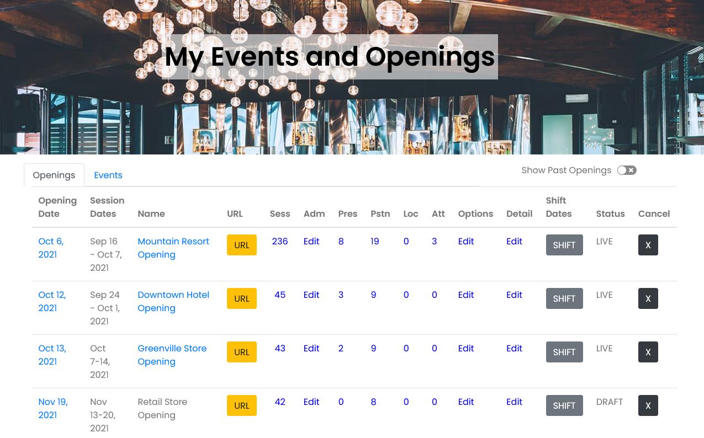

# Manage Event

## My Events 

**Once you have created your Event, as an administrator, this is your home base.**

From here you can make changes to your openings or events, manage presenters, attendees, admins, locations and much more.

### View URL 

Once you have made your event live, you can see your personalized home page at the URL you selected when you created your event.

Go to My Events, select the yellow URL button on the row of the event you want to view and click that to see the full URL.

Also from My Events, you can click on the Name of your event and it will open your personalized site in a new tab.

### Manage Sessions 

Go to My Events.

Under the heading for Sessions \(Sess\) in the row of the Event you want to Edit. The number there indicates how many Sessions are in that Opening or Event.

Select the number which will take you to the next screen.

Select the Session Name \(link shows in blue\)

This will take you to the Edit Session View.

### Event Admins 

As an Account Administrator, you have the ability to add Event Admins specifically for each event or opening.


This is different than adding an Account Administrator.


Here’s an example of why this would be useful:

Let’s say you are managing the scheduling for a large conference. You use a template to create the Event because many of the sessions are the same as last year since it is an annual conference. For the pre-conference set up there is a huge list of logistical items that need to be done and the on-site manager could work much more efficiently with the ability to create sessions for those activities.

**You can set that manager up as an Event Admin so they can create and manage sessions solely for that  event.**


The Event Admin will not have access to any other Openings or Events that you manage from your account.


**Add an Event Administrator Steps**

1. Go to My Events.
2. Select Edit under Adm for the event or opening you want.
3. Select Add Admin.
4. Enter the email address of the person you would like to add as an Event Admin.
5. They will receive an email message to create their login credentials.
6. Once that is complete, you will see their name show in the Account Admins list, rather than Pending.

### Presenters 

Presenters is a generic term for anyone who is leading, teaching, performing or hosting any of the sessions in your opening or event.

Presenters can be added when adding or editing any session individually.

You can also add Presenters to the Event in Manage Presenters individually or via file upload.

#### Manage Presenters 

From My Events click the number in the Pres column. The number indicates how many Presenters are listed in this Event.

You can add a new presenter by clicking the + button.

In the pop up, enter name of the presenter, and the type of presenter. Email is optional. Select SAVE.

The presenter will now be available in the drop down list and you can add them to any session.

#### Add Presenters from File 

You may also upload a list of presenters in a .csv file and assign them to sessions.

Select the up arrow and choose the file to use for upload.



### Tracks 

Every track for an event has a name and assigned color.


Usher makes it easy to fix a typo or pick your favorite colors.  

Select the Edit button next to the position you want to edit and make your changes.


Tracks may also be removed from this Event. Select Delete to remove the track completely from your Event. You will be asked to confirm that you really want to do that before it deletes from the database.


If a track is a Primary track for any existing sessions, you will not be able to delete the track. First change the track for any associated sessions and then delete.


### Locations 

From My Events, select the number under Loc.

Select the yellow Add Location button.

In the pop up box, enter the name of the location. **Name is the only required field.**

Often this is used for specifying a particular conference room or location on a large property rather than an entirely separate address.


_Examples_: Meeting Hall, Hotel Lobby, Booth 45, Main Stage


You may also enter a full address for the location.

**Don't forget to click SAVE.**

### Attendees 

From My Events, select the number in the Att column.

This will open Manage Attendees where you can see the details for each attendee.

#### Add individual attendee 

You can add a new attendee by selecting the + button.

All three fields are required: First Name, Last Name, Email.

In the pop up, enter name of the attendee, and the email address of attendee. SAVE.

#### Add attendees from file 

You may also upload a list of attendees in a .csv file.

Select the up arrow and choose the file to use for upload.



### Notify People of Changes

**Notify Presenters**

To notify Presenters about changes to your opening or event, go to My Events, then choose Edit under Pres \(short for Presenters\) for the one you want.

Next, select the blue envelope icon. A confirmation box will appear and let you know how many emails will be sent and ask if you are ready to send the notifications.

Select SEND to immediately notify all Presenters to check for updates.

**Notify Attendees**

To notify Attendees about changes to your opening or event, go to My Events, then choose Edit under Att \(short for Attendees\) for the one you want.

Next, select the blue envelope icon. A confirmation box will appear and let you know how many emails will be sent and ask if you are ready to send the notifications.

Select SEND to immediately notify all Attendees to check for updates.

### Options 

#### Change Event Name 

The name of your Event can be changed at any time.


Changing the name will not change your custom URL. The custom URL is not editable.


Enter the name and select the yellow SAVE button.

#### Adding more sessions from Template or File 

You can add more sessions to your Opening from a Template or File with the same process as when you are creating your Event.


If you select the same Template again, all sessions from that template will be added a second time and assigned new ID numbers.


### Details 

**Change the Event image**

To change the image, click Browse for Image and select the new image to replace the current one.

Contact Information, Event Details and the Location of the Event can be changed anytime.

**Be sure to scroll down and SAVE your changes.**

### Shift Dates 

This feature allows you to shift the session dates for your entire opening or event.

From My Events, select the SHIFT button for the opening or event you want to change.

In the pop up box, it will tell you: 

> Change the Opening date below and all sessions will shift accordingly. All sessions will shift FULL DAYS forward or backward based on their relation to the current Opening Date.

Choose your new opening date and then select the Shift button. A warning will pop up to make sure you want to shift the dates. Select OK to proceed. Be patient as the dates are shifted for all sessions.

You can shift dates anytime you would like. **Notifications are not sent out to anyone upon date shifting.** You must choose to notify people of the changes.

### Status 

All Events stay in DRAFT status until you choose to GO LIVE. DRAFT status means that the personalized site located at the custom URL you selected in the Create process is not yet viewable.


Once you GO LIVE, you cannot return to DRAFT status.


### Cancel 

From My Events, you may choose to Cancel your entire event.

This will delete the event and all data so be sure you want to do this before proceeding.

Select the X button for the event or opening.

Confirm that you want to do this by selecting OK. **This cannot be undone.**

Your event, customized site and all data will be removed immediately.

