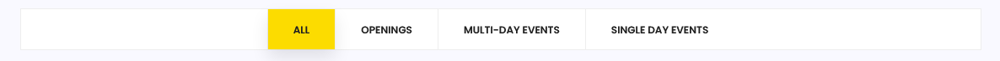

# Find Opening or Event

**Looking for a particular Opening or Event?**

Current and Future Openings are shown in chronological order on the LIST page.

Select **LIST** from the main menu.

Events and Openings are searchable by _name or partial name_. Begin typing and you will see the list automatically adjust to your search criteria.


Filters are available to limit the list by type of event. 

Select:

* Openings
* Multi-Day Events or 
* Single Day Events


Note: Past Events and Openings do not show on the LIST page. The unique URLs for those events will remain active until the organizer removes them which means they are accessible directly with the link even after the final session date.

