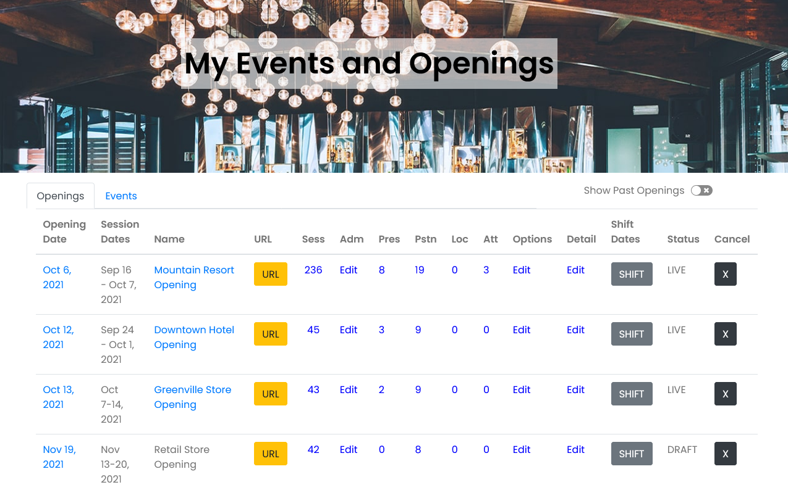

# Manage Opening

## My Events 

**Once you have created your Opening or Event, this is your home base.**

From here you can make changes to your openings or events, manage presenters, attendees, admins, locations and much more.

### View URL 

When you have made your opening or event live, you can see your personalized home page at the URL you selected when you created your opening or event.

Go to My Events, select the yellow URL button on the row of the opening or event you want to view and select that to see the full URL.

To easily copy the URL to your clipboard to paste into an email or other document, select Copy.

Also from My Events, you can select on the Name of your opening or event and it will open your personalized site in a new tab.

### Manage Sessions 

Go to My Events.

Under the heading for Sessions \(Sess\) in the row of the Event or Opening you want to Edit, select the number.

The number there indicates how many Sessions are in that Opening or Event.

Select the Session Name \(link shows in blue\).

This will take you to the Edit Session View.

### Event Admins 

As an Account Administrator, you have the ability to add Event Admins specifically for each event or opening.


This is different than adding an Account Administrator.


Here’s an example of why this would be useful:

Let’s say you are opening a new hotel for your company. You use a template to create the Opening because many of the sessions are the same for each new location you open. At this location there is a unique restaurant and gift shop and you want to give an on-property manager the ability to create and manage specialty sessions to train employees for those property features.

**Add the on-site manager as an Event Admin so they can create and manage sessions solely for that property’s opening event.**


The Event Admin will not have access to any other Openings or Events that you manage from your account.


**Add an Event Administrator Steps:**

1. Go to My Events.
2. Select Edit under Adm for the event or opening you want.
3. Select Add Admin.
4. Enter the email address of the person you would like to add as an Event Admin.
5. They will receive an email message to create their login credentials.
6. Once that is complete, you will see their name show in the Account Admins list, rather than Pending.

### Presenters 

Presenters is a generic term for anyone who is leading, teaching, performing or hosting any of the sessions in your Opening or Event.

Presenters can be added when adding or editing any session individually.

You can also add Presenters to your Opening or Event in the Manage Presenters view either individually or via file upload.

#### Manage Presenters 

From My Events select the number in the Pres column.

The number indicates how many Presenters are listed in this Opening or Event.

You can add a new presenter by selecting the + button.

In the pop up, enter name of the presenter, and the type of presenter. Email is optional. Select SAVE.

The presenter will now be available in the drop down list and you can add them to any session.

#### Add Presenters from File 

You may also upload a list of presenters in a .csv file and assign them to sessions.

Select the up arrow and choose the file to use for upload.



### Positions 

Every position for an Opening has a name and assigned color.

From My Events, select the number under Pstn \(Positions\).


Usher makes it easy to fix a typo or pick your favorite colors.  
Select the Edit button next to the position you want to edit and make your changes.


Positions may also be removed from this Opening. Select Delete to remove the position completely from your Opening. You will be asked to confirm that you really want to do that before it deletes from the database.


If a position is a Primary position for any existing sessions, you will not be able to delete the position. First change the position for any associated sessions and then delete.


### Locations 

From My Events, select the number under Loc.

Select the yellow Add Location button.

In the pop up box, enter the name of the location. **Name is the only required field.**

Often this is used for specifying a particular conference room or location on a large property rather than an entirely separate address.


_Examples_: Kitchen, Conference Room 2, Carlito's Restaurant, Parking Lot B


You may also enter a full address for the location.

**Don't forget to select SAVE.**

### Attendees 

From My Events, select the number in the Att column.

This will open Manage Attendees where you can see the details for each attendee.

#### Add Individual Attendee 

You can add a new attendee by selecting the + button.

All three fields are required: First Name, Last Name, Email.

In the pop up, enter name of the attendee, and the email address of attendee. SAVE.

#### Add Attendees From File 

You may also upload a list of attendees in a .csv file.

Select the up arrow and choose the file to use for upload.



### Notify People of Changes

**Notify Presenters**

To notify Presenters about changes to your opening or event, go to My Events, then choose Edit under Pres \(short for Presenters\) for the one you want.

Next, select the blue envelope icon. A confirmation box will appear and let you know how many emails will be sent and ask if you are ready to send the notifications.

Select SEND to immediately notify all Presenters to check for updates.

**Notify Attendees**

To notify Attendees about changes to your opening or event, go to My Events, then choose Edit under Att \(short for Attendees\) for the one you want.

Next, select the blue envelope icon. A confirmation box will appear and let you know how many emails will be sent and ask if you are ready to send the notifications.

Select SEND to immediately notify all Attendees to check for updates.

### Options 

#### Change Opening Name 

The name of your Opening can be changed at any time.


Changing the name will not change your custom URL. The custom URL is not editable.


Enter the name and select the yellow SAVE button.

#### Adding more sessions from Template or File 

You can add more sessions to your Opening from a Template or File with the same process as when you are creating your Opening.


If you select the same Template again, all sessions from that template will be added a second time and assigned new ID numbers.


### Details 

**Change the Opening image**

To change the image, select Browse for Image and select the new image to replace the current one.

Contact Information, Opening Details and the Location of the Opening can be changed anytime.

**Be sure to scroll down and SAVE your changes.**

### Shift Dates 

This feature allows you to shift the session dates for your entire opening.

From My Events, select the SHIFT button for the opening or event you want to change.

In the pop up box, it will tell you: 

> Change the Opening date below and all sessions will shift accordingly. All sessions will shift FULL DAYS forward or backward based on their relation to the current Opening Date.

Choose your new opening date and then select the Shift button. A warning will pop up to make sure you want to shift the dates. Select OK to proceed. Be patient as the dates are shifted for all sessions.

You can shift dates anytime you would like. **Notifications are not sent out to anyone upon date shifting.** You must choose to notify people of the changes.

### Shift Opening Date ONLY 

From My Events, select the Opening date.

The pop up will ask you for a new opening date.


This option will only change your Opening Date. NO SESSIONS will be affected by this change.


Choose your new Opening date and select Submit Changes.

### Status 

All Openings stay in DRAFT status until you choose to GO LIVE. DRAFT status means that the personalized site located at the custom URL you selected in the Create process is not yet viewable.


Once you GO LIVE, you cannot return to DRAFT status.


### Cancel 

From My Events, you may choose to Cancel your entire opening.

This will delete the event and all data so be sure you want to do this before proceeding.

Select the X button for the event or opening.

Confirm that you want to do this by selecting OK. **This cannot be undone.**

Your opening, customized site and all data will be removed immediately.

## Create Templates 

There are two ways to create templates:

* From an existing opening you have in your account
* By uploading a file of sessions

### Create a template from an existing opening or event 

1. Go to My Events
2. Under the heading for Sessions \(Sess\) in the row of the Event or Opening you want to create a template from, select the Sess number.
3. The next screen is the List of Sessions View.
4. Select the double paper icon.
5. A pop up will ask you to name your Template.
   * The name must be unique.
   * Spaces are allowed.
6. Select SAVE and you have now created a new template that will appear in your drop down list.

### Create a template from a file upload 

Select your account name on the main menu, then select Manage my account, and the Templates tab.

Select the yellow Add a new Template button.

Upload your .csv file to create your template.

The format for the .csv file is the same as for creating a new opening.



## Manage Templates

Templates can be deleted in Manage my account on the Templates tab.

Select Delete and confirm you want to permanently remove the Template from your list.

Templates are not editable but you can download any template, make changes to it and then upload it as a new template. 

