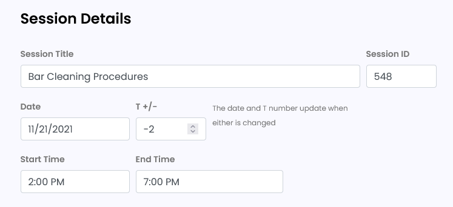
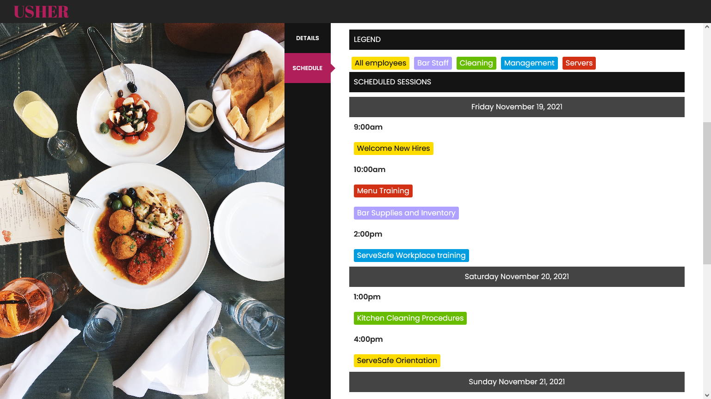

# Add/Edit Sessions

## Add Individual Session 

Once you SAVE the details for your Opening, you will land on the [Manage Sessions](../manage-opening.md#manage-sessions) screen.

From here you can add individual sessions by selecting the + button.

In the Session form view you will see all of the fields that are included in a single session.

These fields are REQUIRED:

* ID (this is required but will be filled automatically if not specified)
* Session Title
* Date or T +/-
* Start Time
* End Time
* Primary Position
* Published (defaults to Yes which means it will show on the Schedule)

Optional Fields:

* Description
* Additional Position(s)
* Categories
* Locations
* Presenters

### Session Title

Each session requires a title. The title can use any combination of letters and numbers. It does not have to be unique. If you have a _Stand-Up Meeting_ daily, that can be the title of each daily session. 

### Session ID 

The session ID must be unique. 

If you do not enter an ID (numeric only) one will be assigned.

### Session Date and T+/- 

The session date and T+/- are linked. Changing one will change the other so you do not have to worry about syncing those.

Each session is set at a T- (or +) number.

* 0 = Opening day
* \-1 = One day before opening
* \-9 = Nine days before opening
* \+1 = One day AFTER opening

Note: You can also enter dates the standard way without using the T+/- and Usher will automatically set your T numbers.

### Start Time and End Time

Select the Start Time and End Time for each session using the arrows or by selecting the number and typing in the exact time.

### Primary Position 

The Primary Position is required and **determines the color coding** that you see on the live schedule.

All positions that have been added to this Opening will be available in the drop-down menu to select.

You can add a new position to the list by selecting Add New Position.

A pop up box will show and you must enter the name of the position and choose a color for that new position.


Everything is easily editable later.


### Additional Positions 


Selecting the Primary Position and Additional Positions determines which people will see this session on their schedule when they use the schedule filters.


**Choose all positions for people who should be attending the session.**

_You do not need to select the Primary Position again in Additional Positions._

### Categories 

Categories provide an optional additional way to filter your schedule.

To add a new category select the Add New Category button and enter the name in the pop up box.

Each session can have multiple categories.

### Session Location 

Usher provides an option to add a specific location for each individual session.


_Examples_: Conference Room B, Front Desk, Antonio's Restaurant, Main Stage


To add a new location to the list, select Add New Location. A pop up box will appear.

**The only required field is the Location Name.**

Optionally, you may add full address details.

### Presenters 

Presenters are optional.

These may include trainers or speakers or anyone presenting information for this session.

To add a new Presenter select the Add New Presenter button. A pop up box will appear.

**First Name, Last Name and Type are REQUIRED.** Email is optional.

Each session may have multiple presenters.

Note: [Presenters can be added later](../manage-opening.md#presenters) from a file and mapped to each session.

## Edit Individual Session 

Go to My Events

1. Under the heading for Sessions (Sess) in the row of the Opening you want to Edit.
2. Select the number (indicates the number of total sessions in your Opening) which will take you to the next screen.
3. Select the Session Name (link shows in blue).
4. This will take you to the Edit Session View.
5. Make any changes to your session details.
6. Be sure to select SAVE CHANGES when done.
