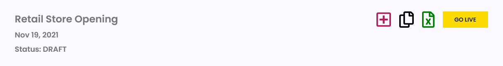

# Go Live

Openings and Events stay in DRAFT status by default until you choose to GO LIVE.

When you are ready to make your unique URL live with your personalized home page and event details, go to My Events, select the number under Sess on the Opening or Event you are ready to make live.

Select the GO LIVE yellow button

You will be prompted to enter your Corporate code first.

If you do not have a code, select the button **I don’t have code** to continue. This begins the checkout process.


For Corporate accounts and subscription accounts, your DRAFT openings and events will never expire.

For all others your DRAFT opening or event will expire, which means it will be archived and no longer editable, 6 months after your Opening Date.


## View your Opening Online 

Once you have made your opening or event live, you can see your personalized home page at the URL you selected when you created your opening or event.

Go to My Events, select the URL button on the row of the opening or event you want to view and select that to see the full URL.

Also from My Events, you can select on the Name of your opening or event and it will open your personalized site in a new tab.

## Filter the Online Schedule 

Filters are available for Positions, Categories and a date range.

You can select more than one of each to view.

To deselect any item, select the X next to that item.

To deselect all items in one group, select the X at the far right side of the selection box.

For a date range, select inside the start box and choose a date from the calendar. Then do the same for the end date.
